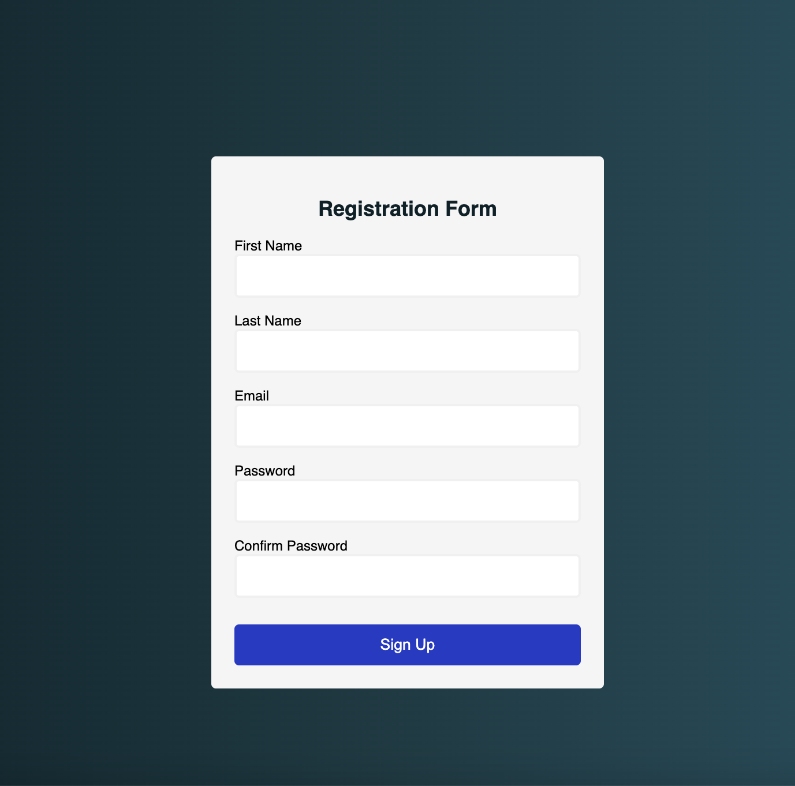

# Form Validation Project

## Overview

This project is a web-based form validation system designed to enhance user input experience. It incorporates features like password validation, which checks for both length and confirmation, and email validation. The form elements visually indicate validation status: input fields turn green when the data is correct and red when incorrect upon submission, providing immediate feedback to the user.

## Project Images

To visualize the functionality and layout of the form, the following images are included:

1. **Basic Form Layout**: 
2. **Validation in Action**: 


Replace `path-to-basic-form-image`, `path-to-validation-image`, and `path-to-error-display-image` with the actual paths where you've stored the images in your repository.

## Features

- **Password Validation**: Ensures the password is of a required length and matches the confirmation input.
- **Email Validation**: Validates email format to ensure it meets standard email structure.
- **Visual Feedback**: Input fields change color based on validation status - green for correct and red for errors.

## Technologies

- HTML & CSS: For structuring and styling the form.
- JavaScript: For implementing the validation logic and dynamic UI updates.

## Installation Guide

1. Clone the repository:
   ```bash
   git clone https://github.com/LurieK/form_validation.git
   ```
2. Open the HTML file in a web browser to view the form.

## How to Contribute

Contributions to improve the form validation functionality or UI/UX are welcome. Please follow the standard fork-and-pull request workflow.

